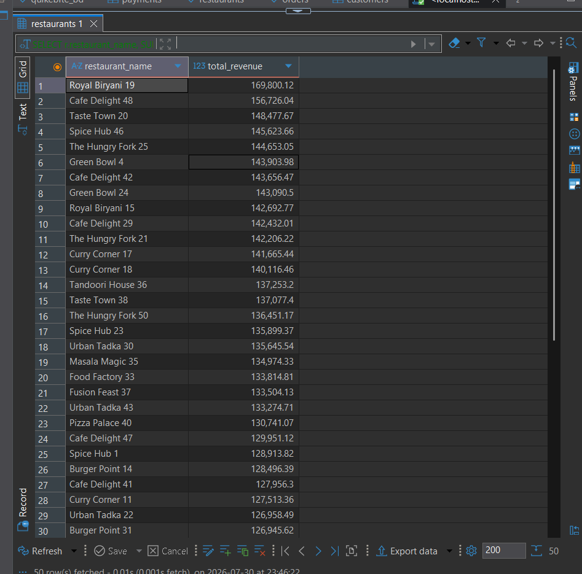
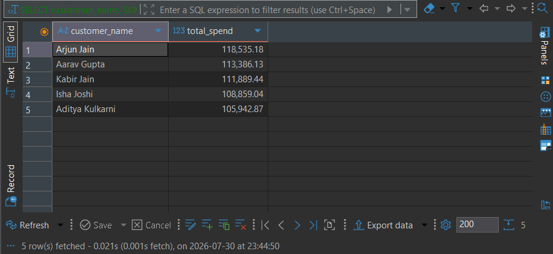
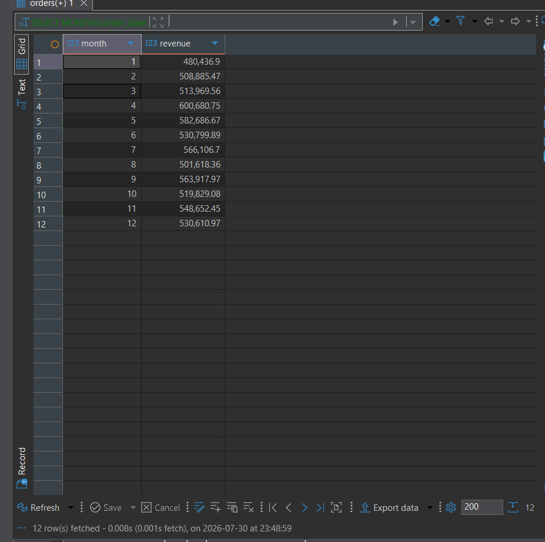
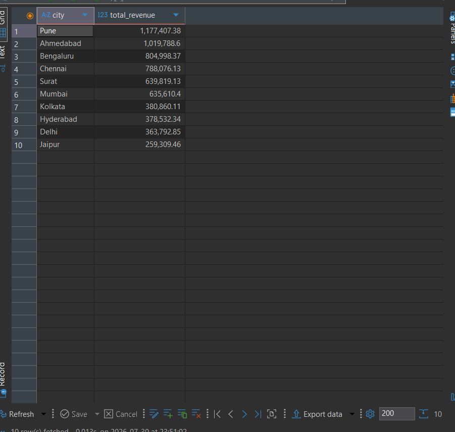
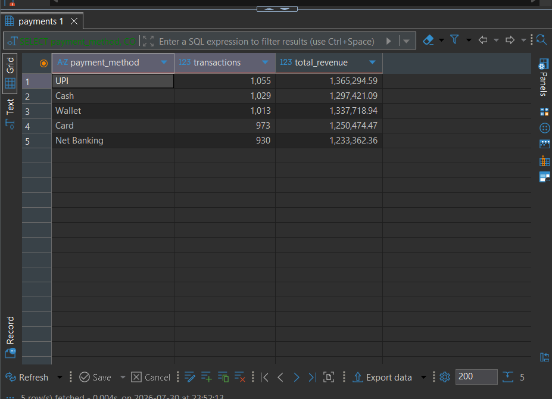

# 🍔 QuickBite — SQL Business Analytics Project

 Transforming raw food delivery data into actionable business insights using SQL.


# 📌 About the Project

QuickBite is a fictional food delivery company facing a common business challenge:

**How can data help improve restaurant performance, customer engagement, and revenue?**

This project uses SQL to answer real business questions by analyzing customer orders, restaurant performance, payment methods, and revenue trends.

Instead of simply writing SQL queries, the project demonstrates how SQL can be used as a decision-making tool for business analysis.

---

# 🎯 Business Problems Solved

✔ Which restaurants generate the highest revenue?

✔ Who are the most valuable customers?

✔ Which cities contribute the most revenue?

✔ What is the most preferred payment method?

✔ Which restaurants consistently receive high ratings?

✔ How does revenue change over time?

✔ Which customers spend above the average?

---

# 🛠 Tech Stack

| Tool | Purpose |
|------|---------|
| MySQL | Database |
| SQL | Data Analysis |
| Git | Version Control |
| GitHub | Portfolio |

---

# 🗄 Database Design

The database consists of five interconnected tables.

| Table | Description |
|-------|-------------|
| Customers | Customer Information |
| Restaurants | Restaurant Details |
| Menu | Restaurant Menu |
| Orders | Order Transactions |
| Payments | Payment Information |

---

# 📐 Entity Relationship Diagram


---

# 📂 Repository Structure

```text
QuickBite-SQL-Business-Insights/
│
├── README.md
├── Database_Schema.sql
├── ER_Diagram.png
│
├── Dataset/
│   ├── customers.csv
│   ├── restaurants.csv
│   ├── menu.csv
│   ├── orders.csv
│   └── payments.csv
│
├── SQL_Queries/
│   ├── 01_Basic_Queries.sql
│   ├── 02_Joins.sql
│   ├── 03_Group_By_Having.sql
│   ├── 04_Subqueries.sql
│   ├── 05_CTE.sql
│   ├── 06_Window_Functions.sql
│   └── 07_Business_Insights.sql
│
└── Screenshots/
```

---

# 📊 SQL Skills Demonstrated

### Data Retrieval

- SELECT
- WHERE
- ORDER BY
- LIMIT

### Aggregation

- COUNT()
- SUM()
- AVG()
- MAX()
- MIN()

### Data Relationships

- INNER JOIN
- LEFT JOIN
- Multi-table JOIN

### Advanced SQL

- GROUP BY
- HAVING
- Subqueries
- EXISTS
- Common Table Expressions (CTEs)
- Window Functions
- RANK()
- DENSE_RANK()
- LAG()

---

# 📈 Business Insights

### 💰 Top Revenue Generating Restaurants

Identified restaurants contributing the highest revenue.

### 👤 Customer Spending Analysis

Found customers spending significantly above average.

### 🌍 City-wise Revenue Analysis

Compared revenue across different cities.

### 💳 Payment Analysis

Analyzed preferred payment methods based on transaction volume.

### ⭐ Restaurant Performance

Ranked restaurants using ratings and revenue.

---

# 📸 Project Preview

## Top Customers by Spending



---

## Top Restaurants by Revenue



---

## Monthly Revenue Trend



---

## Revenue by City



---

## Payment Method Analysis



---

# 🚀 Future Enhancements

- Develop an interactive Power BI dashboard.
- Create SQL Views for reporting.
- Implement Stored Procedures.
- Optimize query performance using Indexes.
- Deploy the database on a cloud platform.

---

# 👨‍💻 About Me

**Pranjal Jain**

### Skills

- SQL
- Python
- Power BI
- Excel
- Pandas
- NumPy
- Machine Learning

---

## ⭐ If you found this project useful, consider giving it a Star!